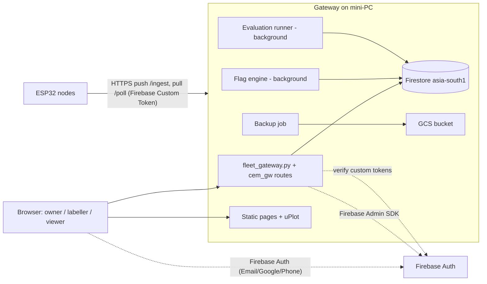

# 05 — Architecture Design Document (ADD)

Version 0.1 draft · 2026-10-05

## 1. Context

Nodes never receive inbound connections. There is no path from the web UI to a node in v1.

## 2. Components
| Component | Responsibility | Notes |
|---|---|---|
| `fleet_gateway.py` | Existing entry point; mounts new routes; initializes Firebase Admin SDK | Edit minimally; behaviour recorded at M0 |
| `ingest.py` | Validate, authenticate (custom token), store batches atomically | Firestore transaction (500 ops) or batched writes |
| `poll.py` | Return config and empty command list; update last-seen | Contains no command logic in v1 |
| `nodes.py` | Registry, calibration; custom token minting for nodes | Admin-only mutations |
| `flags/engine.py` | Incremental rule execution from per-node watermark | Runs every 60 s; queries Firestore subcollections |
| `flags/rules.py` | Pure functions per rule (QF-01..QF-09) | Versioned |
| `api_read.py` | Fleet, series (downsampled), flags, events | Read-only Firestore queries |
| `labels.py`, `timetable.py` | Ground truth and schedule | Immutable labels, supersede model |
| `export.py` | Deterministic CSV + manifest + dictionary | Formula-injection safe; streams from Firestore |
| `evaluation/*` | Replay decision rules, metrics, bootstrap | Pure functions + runner; streams readings in chunks |
| `auth/*` | Firebase Auth verification; custom claims roles; custom token minting | Single `require_role()` guard |
| `audit.py` | Append-only audit log with hash chain | Firestore doc per entry; hash chain in app |
| `backup.py`, `health.py` | Daily backup + verify; liveness | Firestore: gcloud export to GCS bucket. Memory/dev: JSON snapshot + SHA-256 via `POST /admin/backup|restore` (audited, traversal-guarded) |
| `static/*` | Pages and JS | No inline scripts (CSP) |

## 3. Key flows
**Ingest**
```mermaid
sequenceDiagram
  Node->>Gateway: POST /ingest (Bearer <custom_token>, batch)
  Gateway->>Gateway: verify custom token, size/rate check, schema validate
  Gateway->>Firestore: transaction: write readings/{node_id}/samples/{seq}, events/{node_id}/entries/{eseq}; update nodes/{node_id}.last_seen_ts
  Firestore-->>Gateway: commit
  Gateway-->>Node: 200 {accepted, duplicates, last_seq, server_time}
  Note over Node: Node deletes buffered samples up to last_seq only after 200
```
On any error before commit, nothing is stored and the node retries the same batch.

**Flag computation:** engine reads readings/{node_id}/samples where ts_node > watermark (ordered by ts_node), evaluates each rule, writes flags to flags/ collection, advances watermark doc. A new rule version triggers a recompute from the earliest data without touching old flags.

**Labelling:** labeller submits an interval → validated → inserted into labels/ → audit entry → conflicts view recomputed on read. Corrections create a new doc and set `superseded_by` on the old one.

**Evaluation:** admin posts params → `eval_runs` doc (status `queued`) → in-process daemon worker thread runs `run_sync` → status `done`/`failed` with params, versions, data hash. (Spec said "separate process"; built as a thread: pilot-scale, no IPC to secure; revisit if a run ever exceeds ~60 s or blocks the GIL — move to a worker process then.) The page polls status.

**Login (Firebase Auth):** browser signs in with Firebase (Email/Google/Phone) → receives ID token → sends as Bearer → server verifies via Admin SDK → extracts role from custom claims → request proceeds. **Nodes:** backend mints custom token via Admin SDK → node uses it for /ingest and /poll.

## 4. Concurrency model
One process serves HTTP. Background threads run the flag engine (every `CEM_FLAG_INTERVAL_S`, default 60 s) and evaluation jobs on the same store handle. Firestore client is thread-safe; the memory backend holds one lock. Do not hold a Firestore transaction across network or CPU-heavy work.

## 5. Deployment
- Mini-PC, Linux, dedicated user, `systemd` service with restart on failure.
- Reverse proxy terminates TLS; gateway binds to localhost behind it. Firewall allows only the campus subnet; no port forwarding.
- `.env` with 0600 permissions (FIREBASE_SERVICE_ACCOUNT_JSON, CEM_FIREBASE_PROJECT_ID, CEM_FIREBASE_REGION, CEM_BACKUP_DIR for GCS bucket; dev-only CEM_DEV_SECRET/CEM_DEV_ADMIN).
- Time synced via NTP on the server.
- GCS bucket `iot-mcp-backups` for daily Firestore exports; lifecycle policy: delete after 14 days.

## 6. Failure modes
| Failure | Effect | Handling |
|---|---|---|
| Gateway down | Nodes buffer and retry | Backfill on return; gap flags use sequence numbers |
| Firestore unavailable | Ingest/reads fail | 503 with retry-after; node retries with exponential backoff |
| Node clock wrong | Bad timestamps | `CLOCK_DRIFT` flag; receive time kept |
| Node reboots | Possible seq reset | Node must persist `seq`; a decreasing seq raises a fault flag and is stored under a new epoch event |
| Google/Firebase unreachable | No Firebase Auth login | Data collection unaffected (custom tokens work offline once minted); admin cannot login |
| GCS bucket full | Backups fail | Health check warns at 80%; backup job alerts; lifecycle policy prunes old backups |
| Bad flag rule | Wrong flags | Versioned; recompute under a fixed rule version |
| Flag/eval job crash | Stale derived data | Watermarks make restart safe; run status `failed` with error |
| Corrupt export | Wrong dataset | Manifest hash lets a reader verify |

## 7. Extension seams (for later milestones, not v1)
Auth providers (interface), flag rules (registry), evaluation configs (registry), MCP/LLM (read-only API consumers), control (a separate module that must not be importable in v1).
