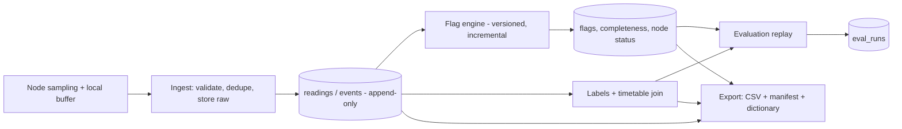

# 08 — Data Pipeline

Version 0.1 draft · 2026-10-05. Thresholds are [DEFAULT] and live in a versioned rules file (`CEM_FLAG_RULES_FILE`). Changing a threshold increments `rule_version`.

## 1. Stages

Raw tables are never edited. Everything downstream is derived and reproducible.

## 2. Sampling and batching defaults
`sample_period_s` = 5 · `batch_interval_s` = 30 · max 200 samples per batch. Current RMS is computed on the node over a whole number of mains cycles. Rough volume: 5 nodes × 17,280 samples/day ≈ 86k rows/day (estimate; verify).

## 3. Power calculation
If a voltage channel exists: `power_w` measured, `power_method='measured'`. Otherwise: `power_w = V_nominal × current_a × PF_assumed`, `power_method='estimated'`, with `V_nominal` and `PF_assumed` stored in node calibration. Every energy figure carries its method. Estimated energy must never be presented as measured.

## 4. Quality flag rules (rule_version 1)
| ID | Flag | Condition | Severity |
|---|---|---|---|
| QF-01 | GAP | Sample time delta > 3 × `sample_period_s`, or seq discontinuity; interval spans the gap | warn; error if > 15 min |
| QF-02 | CLOCK_DRIFT | On live batches, \|`sent_ts` − server receive time\| > 5 s | warn |
| QF-03 | STUCK_PIR | No PIR value change for ≥ 6 h within timetable class hours (or ≥ 12 h if no timetable) | warn |
| QF-04 | STUCK_CURRENT | Current variance exactly 0 for ≥ 60 min while `load_state` = 1, or reading exactly 0 for ≥ 24 h on a weekday | warn |
| QF-05 | OUT_OF_RANGE | Value outside configured bounds (defaults: voltage 80-300 V, current 0-rated max, CO2 300-10000 ppm, temp −5-60 °C, RH 0-100, lux 0-100000) | warn |
| QF-06 | CAL_STALE | Calibration missing or older than 30 days | info |
| QF-07 | BACKFILLED | Sample received > 300 s after its node timestamp | info |
| QF-08 | SEQ_RESET | Seq decreases or node reports `boot` with a lower seq | error |
| QF-09 | FW_MIXED | Nodes in the same experiment arm run different firmware versions | info |

**Completeness** = received samples / expected samples (from `sample_period_s`) over the window. **Node status:** OFFLINE if no ingest within 3 × `batch_interval_s`; DEGRADED if an error-severity flag is active in the last hour or completeness_1h < 90%; otherwise ONLINE.

## 5. Evaluation definitions
**Ground truth:** non-superseded labels with state `occupied` or `vacant`. `unsure` is ignored. Weak (`timetable`) labels are reported separately.
**Decision replay:** for config C and hold time H, a room is declared *vacant* once no presence signal (per C's rules) has been seen for H minutes; it returns to *occupied* on the next presence signal. In shadow mode this is "would cut".
**Metrics:**
- **False-vacant event:** a vacancy declaration starting while ground truth is `occupied`. Reported per room-week.
- **Disruption minutes:** minutes where the room was declared vacant while ground truth was `occupied`.
- **Wasted minutes:** minutes where ground truth is `vacant`, load current is above a configured threshold, and the room was not declared vacant.
- **Energy saved (kWh):** energy of the load during minutes where the room was declared vacant and ground truth was `vacant`. Reported with `power_method`.
- **Energy wasted baseline (kWh):** load energy while ground truth is `vacant` (independent of any config).
- **Label coverage:** labelled hours per state and room; every figure shows the hours behind it.
**Sweep:** configs × H ∈ {2, 5, 10, 15, 20, 30} min → curve of energy saved vs false-vacant events per room-week.
**Statistics:** day-block bootstrap (resample whole days), recorded seed, 95% intervals. Report n days and n labelled hours. No significance claims beyond the intervals.
**Reproducibility:** each run stores params, `rule_version`, code version, and a data hash (SHA-256 over the canonical bytes of the readings, flags, and labels used).

## 6. Labelling protocol (summary)
Scripted trials: volunteers sit still ≥ 30 min, leave and re-enter, with fans on and off; times recorded with the labelling UI. Spot checks: a person records occupied/vacant at a known time without photos. Timetable labels are weak. Each label stores source and initials.

## 7. Export specification
Files: `data.csv`, `manifest.json`, `data_dictionary.md`.
`data.csv` columns: `ts_utc_ms, ts_local_iso, node_id, room_id, seq, current_a, voltage_v, power_w, power_method, pf, pir, mmwave, co2_ppm, lux, temp_c, rh, load_state, backfill, active_flags, label_state, label_source, label_id`. `active_flags` is a semicolon-separated list of flag types covering that timestamp. Text cells beginning with `=`, `+`, `-`, `@` are prefixed with `'`. Rows sorted by `(node_id, ts_utc_ms)`; UTF-8, `\n` line endings, fixed column order, fixed float formatting → byte-identical output for identical inputs.
`manifest.json`: export id, created time, requester, parameters, time range, rooms/nodes, row counts, flag `rule_version`, calibration per node, firmware versions, gateway code version, SHA-256 of `data.csv`.

## 8. Retention, backup, restore
Raw data retained for the practicum and reporting period. Daily backup via `gcloud firestore export gs://iot-mcp-backups/backup-YYYYMMDD`; verify with `gcloud firestore import --dry-run`; keep 14 daily copies (GCS lifecycle policy). Restore drill before acceptance: import to a separate project, run the test suite's smoke checks, compare document counts and collection hashes.

## 9. Pipeline monitoring
Fleet page shows completeness, flags, and last seen. Admin view shows: flag-engine lag per node, last backup time and result, Firestore storage size, GCS backup size, evaluation run status, Firestore read/write quota usage.

## 10. Build notes — 2026-10-05 (as-built record)
- Flag engine reads ONLY new samples per run: a per-node watermark `{last_ts, state}` folds ordered samples through pure `advance()` (chunked == one-shot, TC-QF-12). Stuck-signal lookback needs no re-reads; Firestore cost stays flat.
- QF-04 weekday check uses UTC (recorded choice; display tz is Asia/Kolkata).
- QF-05 current bounds default `[0, 100]` A pending per-node rated max from calibration (override via `CEM_FLAG_RULES_FILE`, bumps `rule_version`).
- Timetable `dow` is Monday=0..Sunday=6, matched in UTC — same convention as the evaluation scheduler and the simulator's synthetic occupancy pattern (UTC hours).
- Overlapping labels resolve by precedence `scripted_trial > spot_check > timetable`, then earliest created; timetable-source minutes are weak (excluded from metrics, counted separately).
- Export columns match §7 exactly; series endpoint decimates joined rows so every field shares one x grid.
